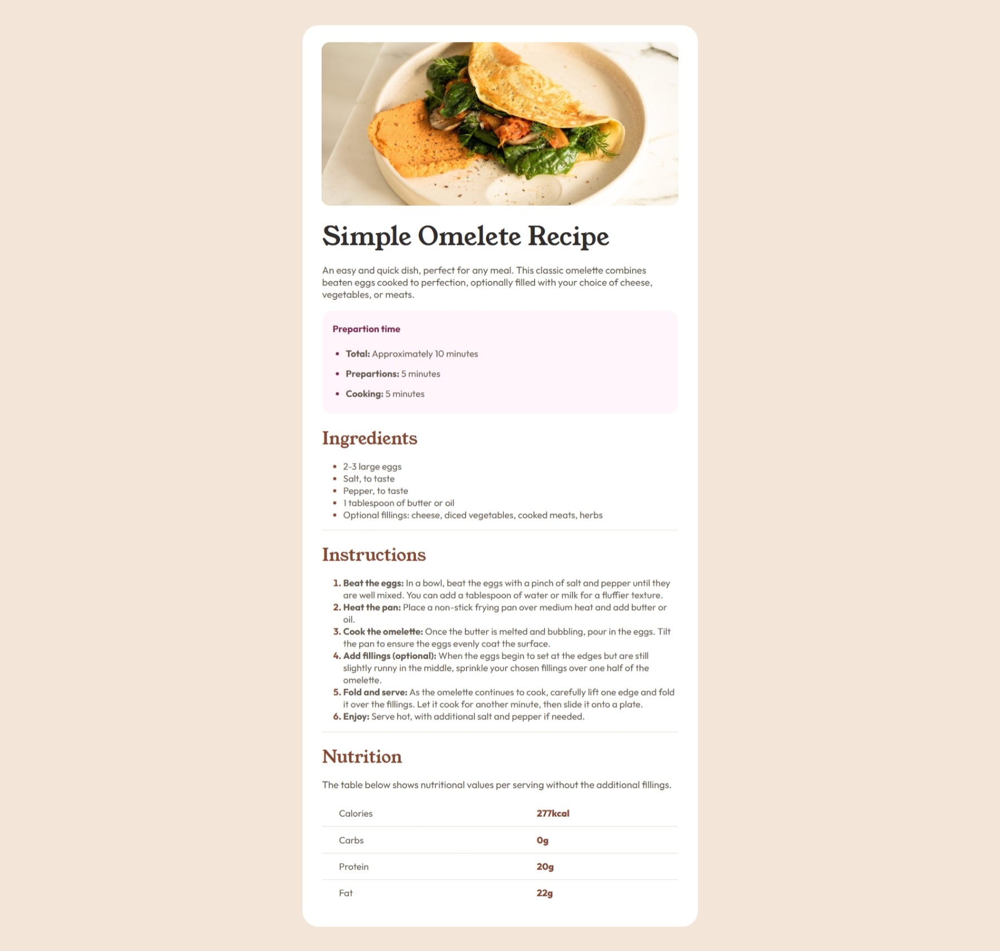

# Frontend Mentor - Recipe page solution

This is a solution to the [Recipe page challenge on Frontend Mentor](https://www.frontendmentor.io/challenges/recipe-page-KiTsR8QQKm). Frontend Mentor challenges help you improve your coding skills by building realistic projects. 

## Table of contents

- [Overview](#overview)
  - [Screenshot](#screenshot)
  - [Links](#links)
- [My process](#my-process)
  - [Built with](#built-with)
  - [What I learned](#what-i-learned)
  - [Continued development](#continued-development)
  - [AI Collaboration](#ai-collaboration)
- [Author](#author)


## Overview

### Screenshot



### Links

- Solution URL: [Solution](https://www.frontendmentor.io/solutions/recipe-page-with-responsive-design-XJLnv4ESTC)
- Live Site URL: [Website](https://osmond20.github.io/Recipe-Page)

## My process

### Built with

- Semantic HTML5 markup
- CSS custom properties
- Flexbox
- CSS Grid
- Mobile-first workflow
- Using GitHub Copilot(Assistant)

### What I learned
I am chuffed at learning how to use elements sematically and practice getting better at them, it helps me understand their uses in building projects.
And was proud of myself for figuring out the responsive design adaptiveness when it came to the recipe page had to fill their entire viewport width
See below code snippets of as hypothetical examples of application:

  ```html
  <div>
    <div>
      <h2></h2>
      <section></section>
    </div>
  </div>
  ```
  ```css
  .recipe_page{
    margin:2rem;
    padding:3rem;

      @media(width<=40rem){
      margin:0;
      padding:0;
    }
  }
```

### Continued development

Will be looking to get better and using flexbox and responsive design because it really helps with buildign optimal layouts that are adaptive 
across all screen sizes and being able to present a full solution that is universally displayed.

### AI Collaboration

Describe how you used AI tools (if any) during this project. This helps demonstrate your ability to work effectively with AI assistants.

- Used github Copilot
- How did you use them (e.g., debugging, generating boilerplate, brainstorming solutions)? Used Github to brainstorm solutions and provide me hint or pointers, if you will, on what topics to focus when I was trying to figure out how I was going to translate a layout that is visible on desktop onto a mobile screen like the screenshot provided
- What worked well? It worked well for me in telling me what to focus and the work is left on me to assert myslef to go and learn, for e.g, media queries, margins & padding, and think more about how I may be applying a CSS property on an html, and like failing forward in seeing how it may impact other elements to overflow and not overflow.
- What didn't? When the AI gives me verbatim the answer, it is stifling, and feels like I didn't learn anything.

**Note: Delete this note and the content above if you didn't use AI, or replace with your own experience.**

## Author

- Website - [Github](https://github.com/osmond20/Recipe-Page)
- Frontend Mentor - [@yourusername](https://www.frontendmentor.io/profile/yourusername)

